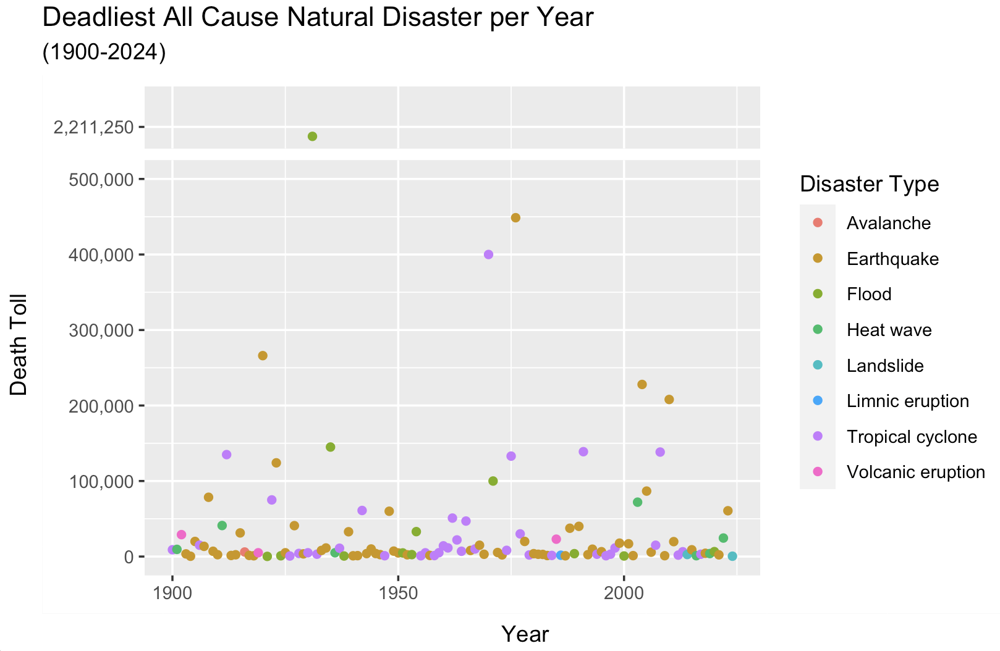

# Data Science PhD Course Placement

#### Emily Potts

#### August 6th, 2024

#### Question 1

The scatterplot depicts the estimated death toll (from all causes, excluding famines and epidemics) and for the deadliest natural disaster of each year from 1900 to 2024. Generally, we see that the majority of years do not have a natural disaster that exceeds 50,000 deaths. However, a decent number of years (spread pretty evenly across 1900 to 2024) have disasters with tolls within 50,000 to 150,000 deaths. While 5 natural disasters since 1900 have had death tolls between 200,000-500,000 lives, the China floods of 1931 stand out as an rare event of interest with over 2 million deaths. Overall, earthquakes, floods, and tropical cyclones appear to most often be the deadliest natural disasters of the year. Across the time span, events such as avalanche, landslide, and limnic eruption have rarely been the most deadly natural disaster. Finally, we can notice the temporal trends that volanic eruptions have decreased in prevalence as the deadliest disaster and deadly heat waves have increased within the 21st century.
